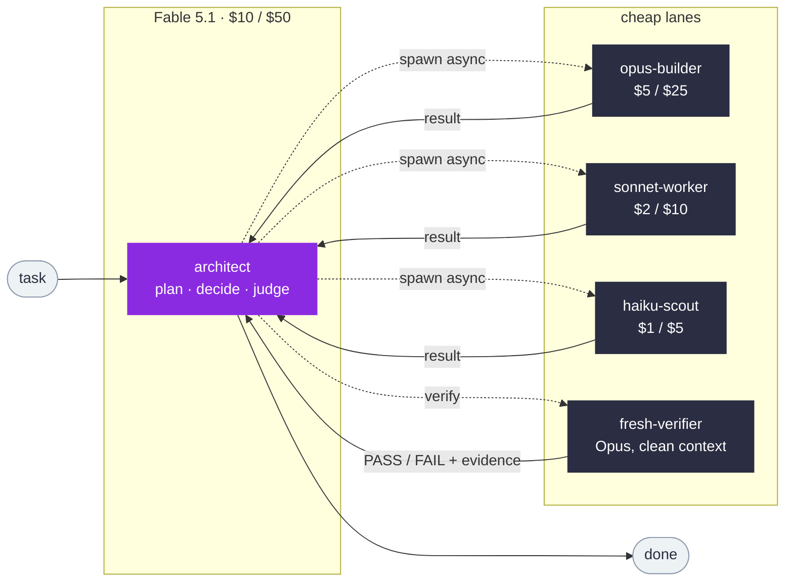
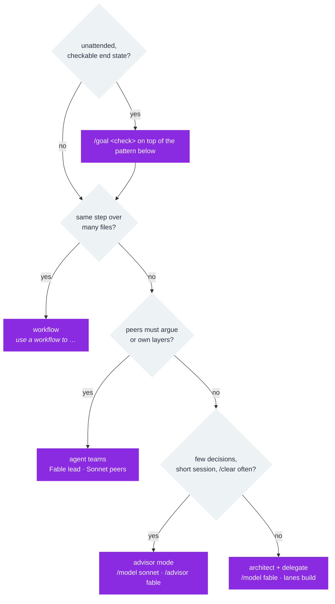

<div align="center">

# rogger-agent-team

**Fable 5.1 decides. Opus 5 builds. Sonnet 5 grinds. Haiku scouts.**<br>
Claude Code plugin. Pay Fable rate for judgment only.

[](https://code.claude.com/docs)
[](https://www.anthropic.com/claude-fable-and-mythos-5-1)
[](LICENSE)
[](skills/rogger-agent-team/reference/models.md#sources)

</div>



## Install

Inside Claude Code:

```
/plugin marketplace add roggern7/rogger-agent-team
/plugin install rogger-agent-team@rogger-agent-team
```

Then merge [`settings/settings.example.json`](settings/settings.example.json) (this repo, or the installed copy under `~/.claude/plugins/marketplaces/rogger-agent-team/settings/`) into `~/.claude/settings.json`. Run `/model fable` per session when the task warrants it. Agents appear as `rogger-agent-team:opus-builder` etc.

## Pick wiring



Advisor re-reads the whole transcript uncached at $10/MTok per consult. Architect reads its own context from cache at $0.25. Cost table in [`wiring.md`](skills/rogger-agent-team/reference/wiring.md#1-advisor-mode).

## Layout

| Path | What |
|---|---|
| [`skills/rogger-agent-team/SKILL.md`](skills/rogger-agent-team/SKILL.md) | Loads on trigger. Lanes, wiring, effort, cost levers, traps, checklist. |
| [`reference/models.md`](skills/rogger-agent-team/reference/models.md) | Facts with sources. Pricing, advisor pairings, 5.1 vs 5 deltas. |
| [`reference/wiring.md`](skills/rogger-agent-team/reference/wiring.md) | Configs for all five patterns. Frontmatter, env, limits, cost table. |
| [`reference/prompt-kit.md`](skills/rogger-agent-team/reference/prompt-kit.md) | 16 paste-in blocks for 5.1, each marked whether Claude Code's Fable system prompt already carries it (checked live). Old-prompt patterns to delete. |
| [`reference/failure-modes.md`](skills/rogger-agent-team/reference/failure-modes.md) | Symptom → cause → fix. |
| [`agents/`](agents) | Five lanes, pinned model + effort + tools. |
| [`settings/`](settings) | `settings.json` examples, `CLAUDE.md` routing block. |

## Four traps

- Cyber-flagged prompt → session **falls back to Opus 4.8** (one transcript notice, then stays there). Bio → Opus 5. `claude --safe-mode` finds the trigger.
- Unpinned subagents **inherit Fable**. `CLAUDE_CODE_SUBAGENT_MODEL=opus`.
- Subagent cache is **5 min**. `subagentPromptCacheTtl: "1h"`.
- A **fork** subagent inherits Fable and the whole transcript, ignoring `CLAUDE_CODE_SUBAGENT_MODEL`. Spawn a named lane instead.

<sub>MIT. Each claim is attributed in <a href="skills/rogger-agent-team/reference/models.md#sources">models.md</a>: Claude Code docs, the Anthropic announcement, or Anthropic's bundled Fable 5.1 migration guidance.</sub>
